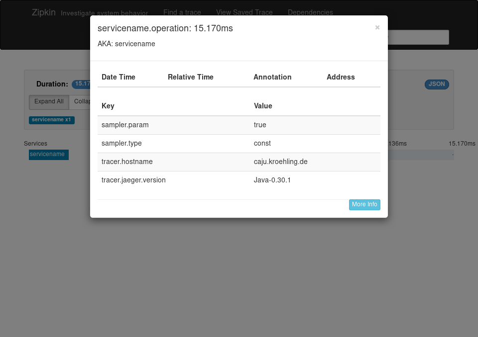

= Vert.x starter with Jaeger tracer and Zipkin reporter

This is a Vert.x starter project (from http://start.vertx.io/), with
just enough code to include Jaeger tracer and Zipkin reporter. 

== Run

Each in a different terminal:
```
$ docker run --rm -p 9411:9411 openzipkin/zipkin
$ ./gradlew run
$ curl localhost:8080
```

Expected outcome: 

